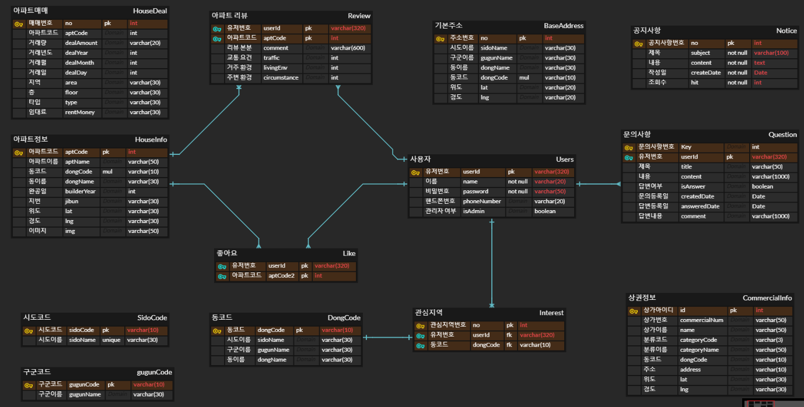
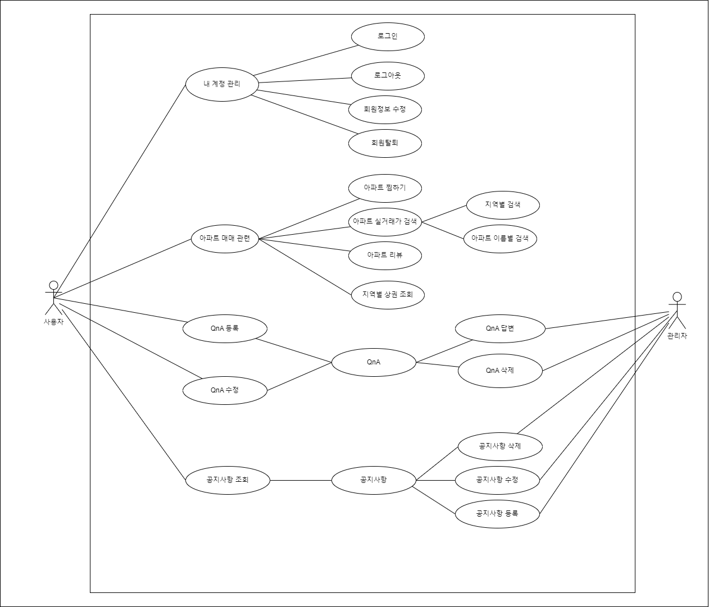
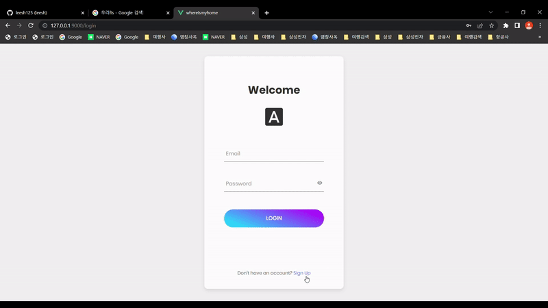
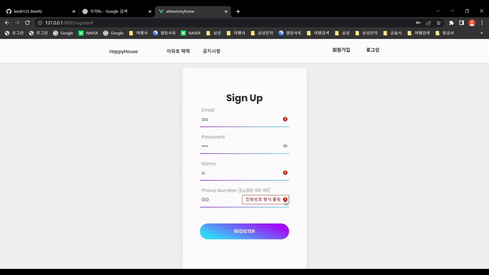
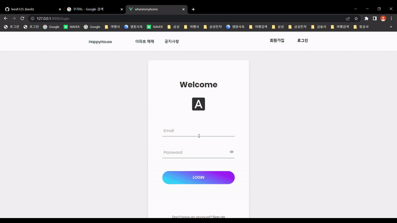
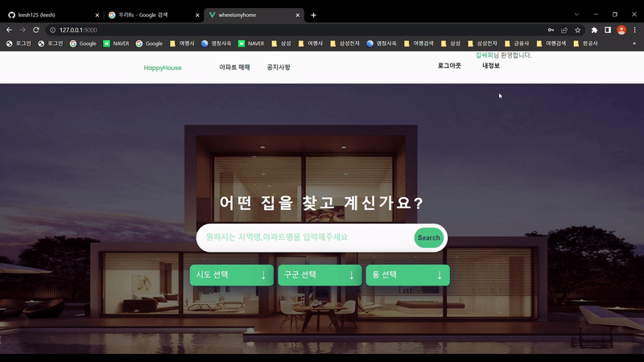
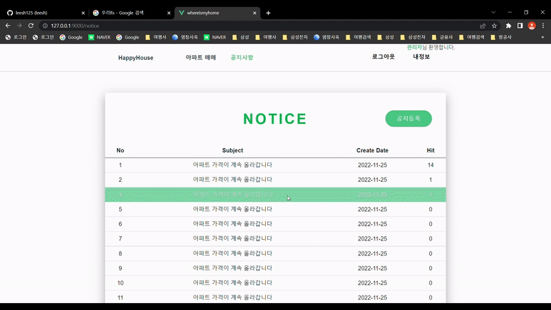
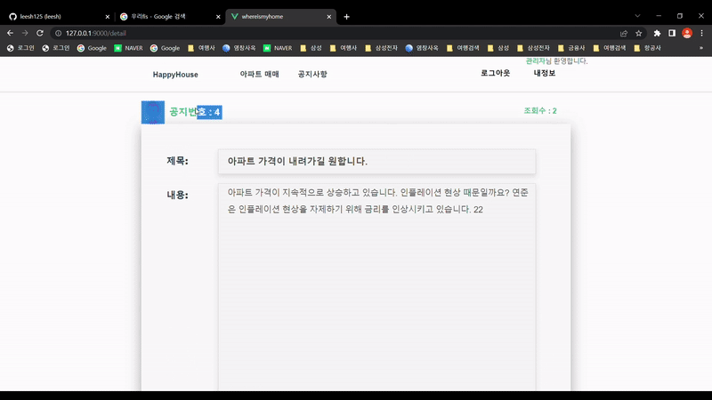
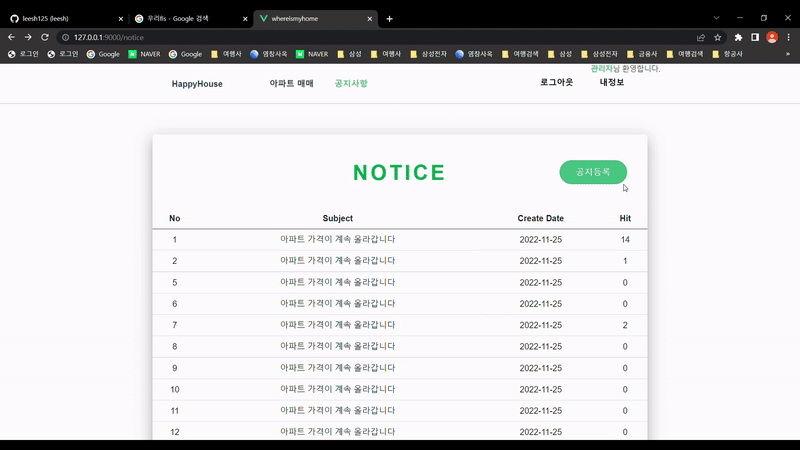
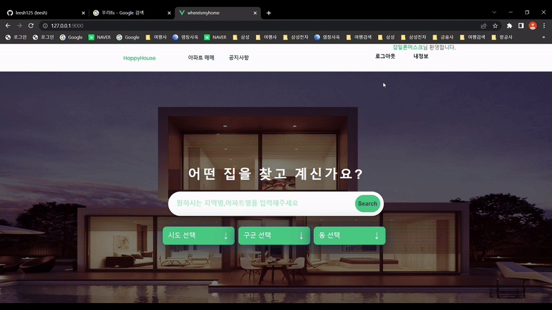

# 🏡SweetHome

<h3>⭐아파트 실거래 정보 제공 웹사이트(SSAFY 8기 1학기 최종 프로젝트)⭐</h3> 

  

## **개요**

- 부동산 매물의 다양한 서비스 제공을 목적으로 아파트 매매 실거래가, 매매 거래내역, 공지사항 기능등을 제공

  

## 프로젝트 기간

- 2022년 11월 14일 ~ 2021년 11월 25일

  

## 기술 스택

API | Vue | SpringBoot |  Java   |  JavaScript   |  MySQL   |   MyBatis  |
| :--------: | :--------: | :--------: | :------: | :-----: | :------: | :------: |
|        |        |       |  |  |  | 

######   

## 팀원

<table>
  <thead>
    <tr>
      <th>이름</th>
      <th>역할</th>
      <th>구현 기능</th>
    </tr>
  </thead>
  <tbody>
    <tr>
      <td rowspan="2">이석현</td>
      <td rowspan="2">팀장</td>
      <td>회원, 공지사항 도메인</td>
    </tr>
    <tr>
      <td>회원 and 공지 Rest API 설계, MyBatis sql 작성, 전체화면 설계/구현, Vue 코드 클라이언트/서버 통신</td>
    </tr>
    <tr>
      <td rowspan="2">이윤환</td>
      <td rowspan="2">팀원</td>
      <td>아파트 도메인</td>
    </tr>
    <tr>
      <td>아파트 Rest API 설계, MyBatis sql 작성, Vue 코드 실거래가 조회 클라이언트/서버 통신</td>
    </tr>
  </tbody>
</table>

  

## **ERD(ER Diagram)**

  

## UML(Usecase Diagram)

  

## 실행 화면

### 🔗 회원가입

✅ 회원 분류 (일반 회원 / 기업 회원) 2가지, 아이디 중복체크, 비밀번호 이중 체크

✅ 비밀번호, 비밀번호 확인이 같지 않으면 비밀번호가 일치하지 않음을 표시

  

### **🔗 로그인**

✅ Commons Email을 활용한 회원 인증을 거침. 인증에 실패하면 다시 로그인, 성공하면 사용자 이름과 함께 환영합니다 메시지.

  

### **🔗 내 정보 확인**

✅ 로그인한 사용자의 정보를 

  
---

### **🔗 메인페이지 검색**

✅ 메인 페이지에서 아파트 검색, 아파트 매매 페이지로 이동

  

### **🔗 키워드로 검색**

✅ 선택한 지역에서 아파트 이름 검색

  

### **🔗 거래내역 조회**

✅ 아파트별 상세 거래내역 조회와 좋아요 기능

  

### **🔗 관심지역**

✅ 현재 검색중인 지역을 관심지역에 추가, 선택시 검색 지역 자동 변경

  

---

### **🔗 공지사항 수정**

✅ 공지사항 상세 조회 버튼을 클릭하여 수정, 공지번호는 수정 불가

  

### **🔗 공지사항 삭제**

✅ 공지사항 삭제 실시

  

### **🔗 공지사항 등록**

✅ 공지사항 등록 실시

  

### **🔗 로그아웃**

✅ 로그인 한 유저를 로그아웃, Vue Store와 Session에 있는 값들을 초기화 함

  
<!-- Stack Icon Refernces -->

[vue]: ./assets/img/vue.svg
[springboot]: https://destatic.blob.core.windows.net/images/spring-boot-logo.png
[react]: /images/stack/react.svg
[node]: /images/stack/node.svg
